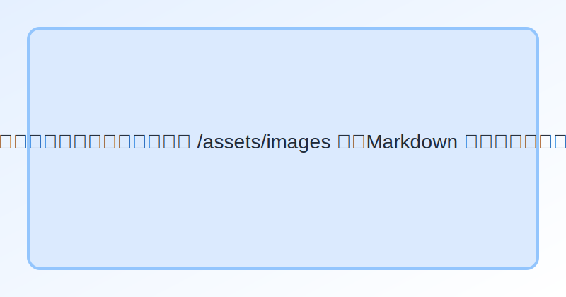

# JIT / FBS QA 文件

歡迎來到 **JIT FBS相關問題** 知識庫。左側選單可切換頁面；本專案完全使用 Markdown 撰寫，圖片放在 `assets/images` 內。

- 站點支援深色模式（右上角 🌓）
- 可在 Markdown 內嵌入圖片與 YouTube

## 插入圖片示例

> 只要將圖片丟入 `assets/images/`，以相對路徑 `../assets/images/<檔名>` 引用。

## 嵌入 YouTube 示例
> 在 Markdown 直接貼 HTML iframe 即可：
<iframe width="560" height="315" src="https://www.youtube.com/embed/dQw4w9WgXcQ"
title="YouTube video player" frameborder="0" allow="accelerometer; autoplay; clipboard-write; encrypted-media; gyroscope; picture-in-picture" allowfullscreen></iframe>
